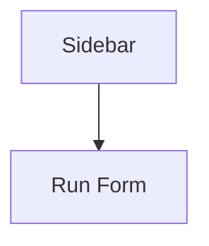
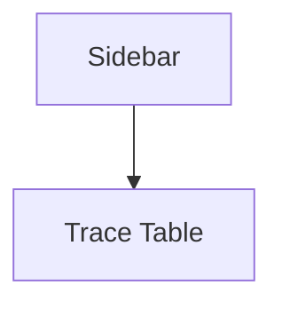
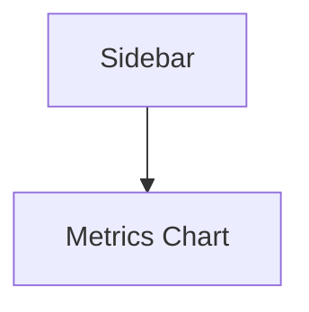
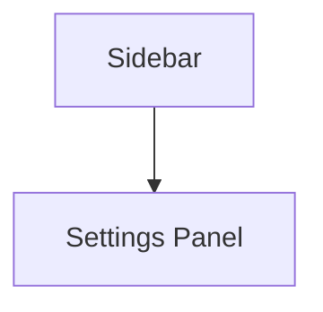

# UI Upgrade Spec

## Backlog
### P0
- **Unified form** consolidates run inputs with `st.form` for atomic submits. *Effort: M.*
```python
with st.form("run"):
    cfg = st.text_input("Config")
    submitted = st.form_submit_button("Start")
```
- **Standard status & progress** uses `st.status` and `st.progress` to signal work. *Effort: S.*
```python
with st.status("Running") as s:
    for pct in steps:
        s.update(progress=pct)
```
- **Error UX & recovery** shows `st.error` with retry hook. *Effort: M.*
```python
try:
    run()
except Exception as e:
    if st.button("Retry"):
        run()
```
- **Theme & a11y baseline** loads palette and font from `.streamlit/config.toml`. *Effort: M.*
```toml
[theme]
base="light"
primaryColor="#3366cc"
```
- **Trace viewer overhaul** rewrites table with adapters. *Effort: L.*
```python
trace_df = adapter.fetch()
st.dataframe(trace_df)
```
- **Telemetry events** emit metrics via lightweight logger. *Effort: S.*
```python
log_event("start_run", run_id)
```

### P1
- **Sidebar taxonomy + typed `RunConfig`** organizes options. *Effort: M.*
- **Multipage structure** with `pages/` and programmatic nav. *Effort: M.*
- **Surveys (SUS/SEQ)** prompt after runs. *Effort: S.*
- **Performance caching & pagination** keeps UI responsive. *Effort: L.*

### P2
- **Polish and follow ups**: keyboard shortcuts, animations, copy tweaks. *Effort: ongoing.*

## Wireframes
### Main Page


### Trace Page


### Metrics Page


### Settings Page


## Dependencies
- Telemetry events feed metrics dashboards.
- Trace overhaul depends on unified form outputs.
- Theme baseline shared across pages via adapters.
