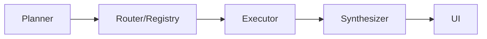

# DR-RD Streamlit App User Guide

## Overview and Capabilities
DR-RD is an AI research and development workbench that takes a project idea, plans tasks, routes them to specialized agents, executes the plan, and synthesizes a proposal. The Streamlit interface exposes a thin UI while the orchestration logic lives in backend modules.



## Quick Start
### Streamlit Community Cloud
1. Fork the repository and deploy from the Streamlit workspace. Streamlit Cloud builds most apps in minutes and only needs a GitHub link.
2. In the app's *Advanced settings*, paste required secrets such as `OPENAI_API_KEY` and `SERPAPI_KEY`.
3. Click **Deploy** and open the resulting URL to start using the app.

### Local Development
1. Install Python 3.10+ and Git.
2. Clone the repo and install dependencies:
   ```bash
   git clone https://github.com/clcriswell/DR-RD.git
   cd DR-RD
   python -m venv .venv
   source .venv/bin/activate  # Windows: .venv\Scripts\Activate.ps1
   pip install -r requirements.txt
   ```
3. Provide API keys via environment variables or a `.env` file.
4. Launch the app:
   ```bash
   streamlit run app.py
   ```

## Configuration
Most run-time options live in the sidebar:
- **Project idea** – free‑form text describing the goal.
- **Mode** – selects presets that control target cost, retrieval, and search behavior.
- **Knowledge sources** – choose built-in or uploaded sources for RAG.
- **Diagnostics** – toggle agent trace and verbose planner output.
- **Exports** – auto-export trace or report after a run.
- **Advanced options** – temperature, retries, and overall timeout.

Modes are defined in `config/modes.yaml` and include switches for vector search and live web search.

## Using the App
1. Enter an idea in the sidebar and adjust settings.
2. Click **Run** (from the main page) to generate a plan, execute tasks, and view results.
3. Review the synthesized proposal in the main panel.

## Agent Trace
When **Show agent trace** is enabled, a Trace page becomes available:
- **Live Status** shows per-task progress, token counts, and cost.
- **Role tabs** display each agent's output with optional raw views.
- **Run Diff** compares two runs and can export incident bundles.
- **Trace Viewer** lets you filter steps and download JSON, CSV, or Markdown reports.

## Retrieval and Web Search
The system first queries a FAISS vector index when retrieval is enabled. If no context is found and live search is on, a web search backend such as OpenAI or SerpAPI provides additional snippets. Both pathways respect retrieval budgets to avoid excessive calls.

## Budgets and Cost Meter
Each mode targets a total cost (e.g., $2.50 for *standard*). The cost meter estimates remaining budget before a run and shows actual vs. projected spend afterward.

## Export and Downloads
- Automatic export options produce trace files or markdown reports on completion.
- The Trace viewer provides buttons to download the full trace (JSON), a summary (CSV), or a readable report (Markdown).
- Generated reports can be saved as PDF via the **Download PDF** button.

## Troubleshooting
- **Missing API key** – ensure `OPENAI_API_KEY` and optional search keys are set.
- **Quota or network errors** – retry later; costs are shown in the trace.
- **Empty results** – check that RAG and live search are enabled for the chosen mode.
- **PDF issues** – ensure documents have fewer than 50 pages.

## Security and Privacy
Secrets are stored in Streamlit's encrypted settings or local `.env` files. Only the provided API keys are sent to external services. Trace exports redact sensitive fields based on repository policies.

## FAQ
**What does Mode control?** Preset budgets, model choices, and retrieval defaults.

**Can I rerun a session?** Use the **Retry run** button shown on error banners or rerun with the same idea.

**Where are files saved?** Downloads are temporary; the container's filesystem is ephemeral.

## Observed vs Intended
| Feature | Observed | Intended | Recommendation |
|--------|----------|---------|----------------|
| RAG toggle | Enabled via mode only | Explicit UI toggle | Consider exposing a direct RAG checkbox for clarity |
| PDF export | Manual button | Auto-export on completion | Document automation or enable by default |

## Glossary
- **RAG** – Retrieval-Augmented Generation, using a vector index to supply context.
- **SerpAPI** – Web search API used for live search when enabled.
- **Trace** – Detailed log of planner, executor, and synthesizer steps.
